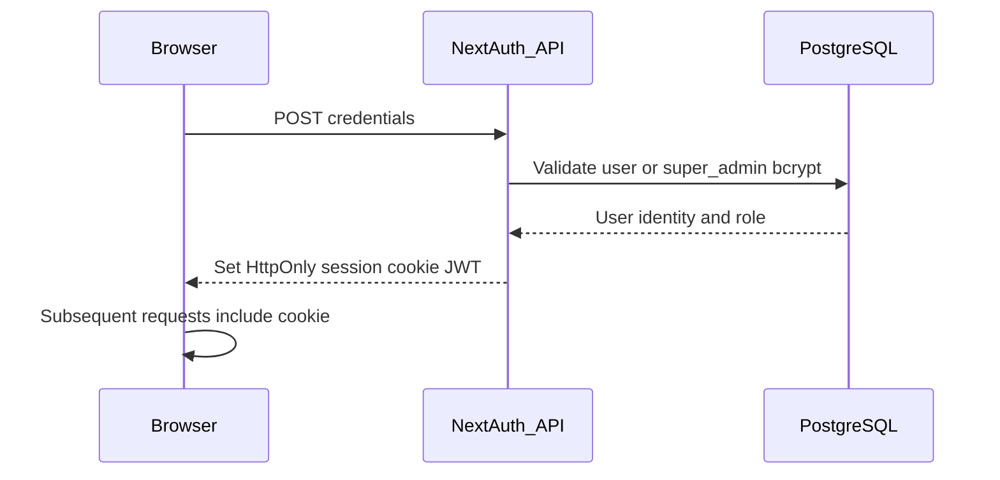
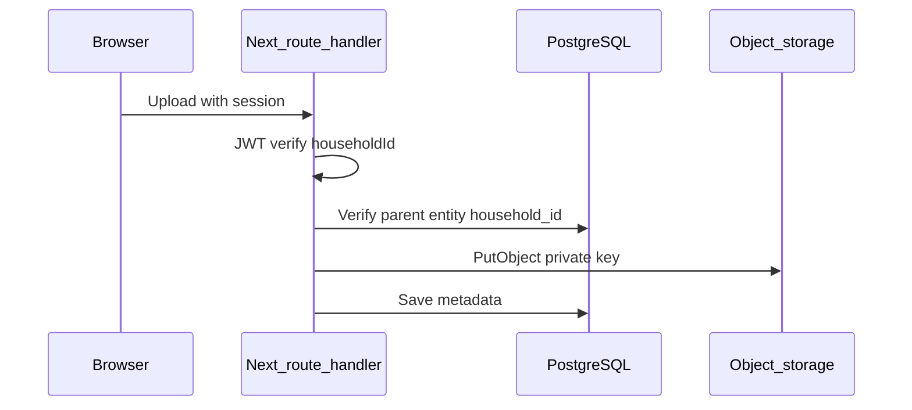
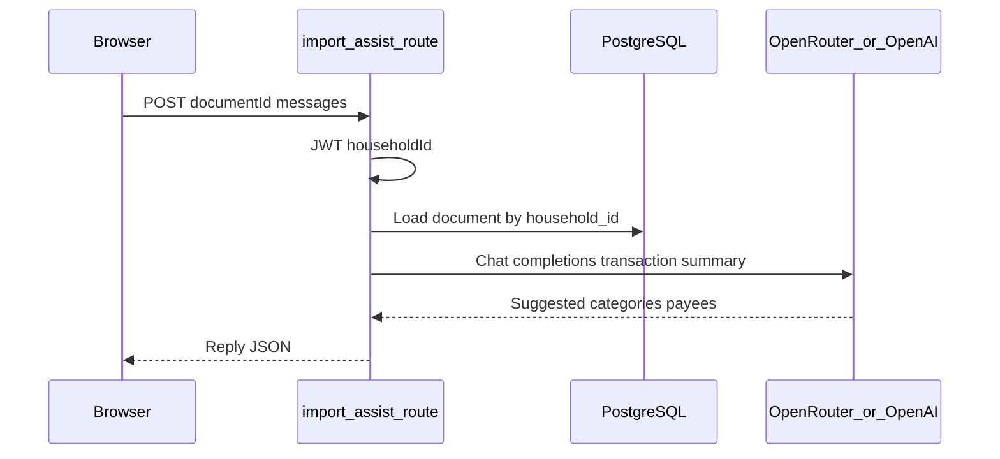
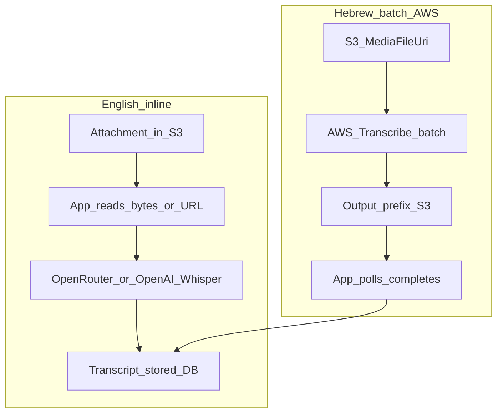

# Asset inventory and record of processing (ROPA-style)

This document supports security and privacy assurance for **home_finances_app**. It is **not legal advice**; align with counsel for your jurisdiction(s).

## 1. Asset inventory

| Asset category | Examples in this application | Primary storage / transit |
|----------------|------------------------------|---------------------------|
| Authentication secrets | `NEXTAUTH_SECRET`, session JWT | Vercel env, HTTPS cookies |
| Account credentials | Password hashes (`bcrypt`), super-admin table | PostgreSQL |
| Identity / contact | User email, full name, household membership | PostgreSQL |
| Financial data | Transactions, accounts, loans, insurance, savings | PostgreSQL |
| Therapy / private clinic | Clients, treatments, receipts, appointments, diary exports | PostgreSQL |
| Uploaded files | Bank imports, contracts, job docs, car docs, therapy attachments | S3-compatible object storage |
| Audio for transcription | Therapy treatment attachments (paths via DB; bytes in S3) | S3 → app or AWS Transcribe / OpenAI Whisper |
| AI-assisted import | Transaction summaries and chat messages sent to LLM | HTTPS to OpenRouter or OpenAI |
| Operational logs | Vercel/runtime logs (must not contain secrets or bulk PII) | Vercel / host |

## 2. ROPA-style processing table

| Processing activity | Purpose | Data categories | Legal basis (placeholder) | Retention (placeholder) | Subprocessors |
|---------------------|---------|-----------------|---------------------------|---------------------------|---------------|
| User login | Authenticate users | Email, password hash, session | Contract / legitimate interest | Session + account lifetime | Vercel (host), PostgreSQL |
| Household finance management | Core product | Financial + household config | Contract | Per product policy | Neon (or self-hosted Postgres), Vercel |
| Private clinic / therapy module | Professional workflow | Client identifiers, clinical-adjacent metadata, amounts | Contract / professional obligation | Per product policy | Same as above |
| File upload / download | Attach documents to entities | File bytes, metadata | Contract | Per product policy | Object storage (e.g. AWS S3) |
| Import assist (AI) | Categorize imported transactions | Transaction IDs, descriptions, amounts, chat | Contract / consent for AI | Minimize; vendor retention per DPA | OpenRouter and/or OpenAI |
| Transcription (EN) | Text from audio | Audio via API; transcript | Contract / consent | Minimize; vendor retention | OpenRouter and/or OpenAI |
| Transcription (HE batch) | Hebrew transcription | S3 URIs, audio in S3 | Contract / consent | Per AWS + product policy | AWS Transcribe, S3 |
| Backups | Recovery | All DB categories | Legitimate interest / contract | Per Neon backup policy | Neon |
| Admin / support | Operate service | As needed for ticket | Legitimate interest | Ticket system policy | As used |

Fill **legal basis** and **retention** with your counsel and product terms.

## 3. Data-flow diagrams

### 3.1 Authentication (session JWT)

### 3.2 File upload (household-scoped)

### 3.3 Import assist (LLM)

### 3.4 Transcription (English path vs Hebrew batch)

## 4. Trust boundaries

- **Browser**: XSS risk; CSP and safe React patterns reduce impact.
- **Vercel edge / Node**: JWT validation, **must** enforce `household_id` on every data access.
- **PostgreSQL**: Encryption at rest (provider); TLS in transit (`DATABASE_URL`).
- **Object storage**: Private buckets; app streams downloads after auth check.
- **External AI**: Highest privacy variance—minimize payloads, DPAs, zero-retention where available.

## 5. Review cadence

- Revisit this document when adding features, new subprocessors, or new regions.
